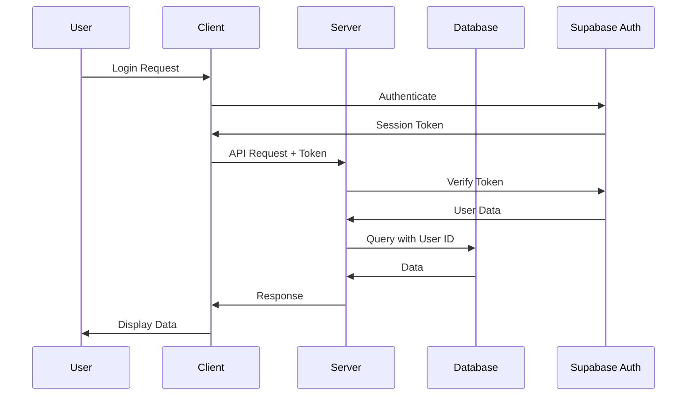
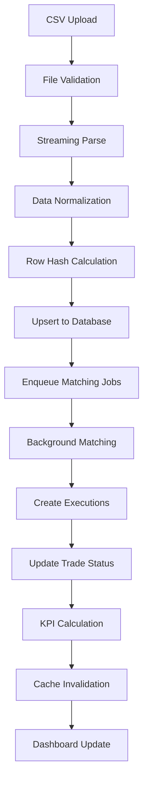
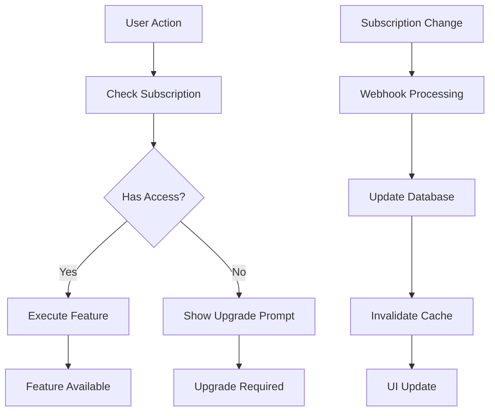
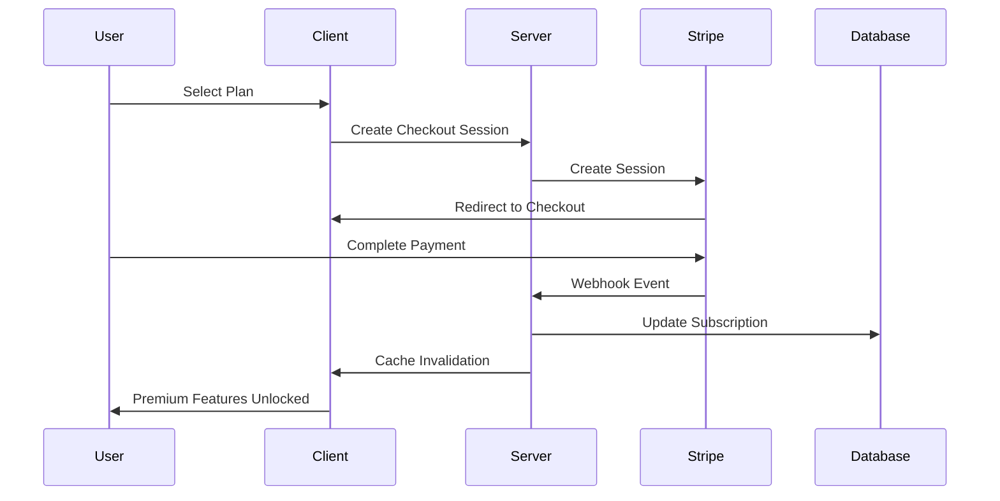
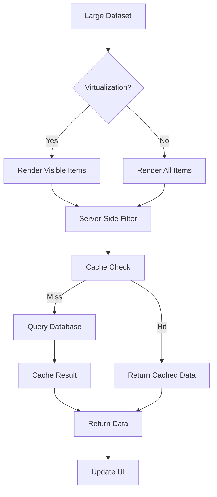

# Data Flows Documentation

This document provides comprehensive diagrams and step-by-step flows for the key data processes in the trading journal application.

## Table of Contents

1. [Authentication Flow](#authentication-flow)
2. [Import → Match → KPI Flow](#import--match--kpi-flow)
3. [Entitlement Gating Flow](#entitlement-gating-flow)
4. [Subscription Management Flow](#subscription-management-flow)
5. [Performance Optimization Flow](#performance-optimization-flow)

---

## Authentication Flow

### Overview
The authentication system uses Supabase Auth with server-side verification and client-side session management.

### Flow Diagram



### Step-by-Step Process

1. **User Login**
   - User enters credentials on login page
   - Client sends auth request to Supabase Auth
   - Supabase validates credentials

2. **Session Creation**
   - Supabase returns session token
   - Client stores token in secure storage
   - Session includes user ID and permissions

3. **API Requests**
   - Client includes token in Authorization header
   - Server validates token with Supabase
   - Server extracts user ID from token

4. **Data Access**
   - Server queries database with user ID
   - RLS policies enforce user-specific access
   - Data returned to client

5. **Session Management**
   - Token refresh handled automatically
   - Logout clears session and token
   - Session expires after configured time

### Key Components

- **Client**: `src/providers/auth-provider.tsx`
- **Server**: `src/lib/auth/getUserOrThrow.ts`
- **Middleware**: `middleware.ts`
- **Database**: RLS policies in Supabase

---

## Import → Match → KPI Flow

### Overview
The complete data pipeline from CSV import through trade matching to KPI calculation and display.

### Flow Diagram



### Step-by-Step Process

#### 1. CSV Import Phase

**File Upload & Validation**
```typescript
// File size and type validation
const MAX_FILE_SIZE = 50 * 1024 * 1024; // 50MB
const allowedTypes = ['text/csv', 'application/csv'];

// MIME type check
if (!allowedTypes.includes(file.type)) {
  throw new Error('Invalid file type');
}
```

**Streaming Parse**
```typescript
// Chunked processing for large files
const parser = csvParser({
  headers: true,
  skipEmptyLines: true
});

// Process in chunks to avoid memory issues
for await (const chunk of fileStream) {
  const rows = parse(chunk);
  await processRows(rows);
}
```

**Data Normalization**
```typescript
// Standardize data formats
const normalizedRow = {
  symbol: row.Symbol?.toUpperCase(),
  side: row.Side?.toUpperCase(),
  quantity: parseFloat(row.Quantity),
  price: parseFloat(row.Price),
  opened_at: parseDate(row.Date),
  // ... other fields
};
```

#### 2. Idempotency & Storage

**Row Hash Calculation**
```typescript
// Create unique hash for each row
const rowHash = createHash('sha256')
  .update(JSON.stringify(normalizedRow))
  .digest('hex');
```

**Database Upsert**
```typescript
// Upsert to prevent duplicates
await supabase
  .from('trades')
  .upsert({
    ...normalizedRow,
    row_hash: rowHash,
    user_id: userId,
    import_run_id: importRunId
  }, {
    onConflict: 'user_id,row_hash'
  });
```

#### 3. Matching Phase

**Job Enqueueing**
```typescript
// Create matching jobs for each symbol/date batch
const batches = groupBySymbolAndDate(trades);
for (const batch of batches) {
  await supabase
    .from('matching_jobs')
    .insert({
      user_id: userId,
      symbol: batch.symbol,
      date_batch: batch.date,
      status: 'pending'
    });
}
```

**Background Processing**
```typescript
// Process matching jobs
const jobs = await getPendingJobs();
for (const job of jobs) {
  await processMatchingJob(job);
  await updateJobStatus(job.id, 'completed');
}
```

**Trade Matching Logic**
```typescript
// Match trades based on symbol, date, and quantity
const matches = findMatches(trades);
for (const match of matches) {
  await createExecution({
    user_id: userId,
    symbol: match.symbol,
    side: match.side,
    quantity: match.quantity,
    price: match.price,
    executed_at: match.date
  });
}
```

#### 4. KPI Calculation Phase

**Server-Side Calculation**
```typescript
// Calculate KPIs on server
const kpis = {
  totalPnl: calculateTotalPnl(trades),
  winRate: calculateWinRate(trades),
  sharpe: calculateSharpeRatio(trades),
  maxDrawdown: calculateMaxDrawdown(trades)
};
```

**Cache Management**
```typescript
// Cache KPI results
const cachedKPIs = await unstable_cache(
  () => calculateKPIs(userId),
  ['kpi', userId],
  { revalidate: 300 }
);
```

**Cache Invalidation**
```typescript
// Invalidate cache after data changes
revalidateTag('kpi');
revalidateTag('trades');
```

### Key Components

- **Import API**: `app/api/import/csv/route.ts`
- **Matching API**: `app/api/matching/process/route.ts`
- **KPI API**: `app/api/kpi/summary/route.ts`
- **Database**: Trades, executions, matching_jobs tables

---

## Entitlement Gating Flow

### Overview
Premium feature access control based on subscription status with server-side verification.

### Flow Diagram



### Step-by-Step Process

#### 1. Feature Access Check

**Client-Side Check**
```typescript
// PremiumGate component
const { data: subscription } = useApi('/api/me/subscription');

if (!subscription.entitled || subscription.tier < requiredTier) {
  return <UpgradePrompt tier={requiredTier} />;
}

return <PremiumFeature />;
```

**Server-Side Verification**
```typescript
// API route verification
const subscription = await getSubscriptionStatus(userId);
if (!subscription.entitled) {
  return NextResponse.json(
    createApiError(ERROR_CODES.FORBIDDEN, 'Premium feature required'),
    { status: 403 }
  );
}
```

#### 2. Subscription Status

**Database Lookup**
```typescript
// Get user subscription
const { data: subscription } = await supabase
  .from('subscriptions')
  .select('*')
  .eq('user_id', userId)
  .eq('status', 'active')
  .single();
```

**Feature Mapping**
```typescript
// Map subscription tier to features
const features = {
  free: ['basic_features'],
  basic: ['limited_trades', 'basic_imports'],
  pro: ['unlimited_trades', 'advanced_analytics'],
  enterprise: ['unlimited_trades', 'white_label']
};
```

#### 3. Webhook Processing

**Stripe Webhook**
```typescript
// Verify webhook signature
const event = stripe.webhooks.constructEvent(
  body, signature, webhookSecret
);

// Process subscription change
if (event.type === 'customer.subscription.updated') {
  await updateSubscription(event.data.object);
}
```

**Cache Invalidation**
```typescript
// Invalidate subscription cache
revalidateTag('subscription');
revalidateTag('user');
```

### Key Components

- **Premium Gate**: `src/components/premium/PremiumGate.tsx`
- **Subscription API**: `app/api/me/subscription/route.ts`
- **Webhook Handler**: `app/api/webhooks/stripe/route.ts`
- **Database**: Subscriptions, user_entitlements tables

---

## Subscription Management Flow

### Overview
Complete subscription lifecycle from signup to cancellation with Stripe integration.

### Flow Diagram



### Step-by-Step Process

#### 1. Subscription Creation

**Checkout Session**
```typescript
// Create Stripe checkout session
const session = await stripe.checkout.sessions.create({
  customer: customerId,
  line_items: [{
    price: priceId,
    quantity: 1
  }],
  mode: 'subscription',
  success_url: `${baseUrl}/dashboard?success=true`,
  cancel_url: `${baseUrl}/pricing`
});
```

**Database Update**
```typescript
// Store subscription in database
await supabase
  .from('subscriptions')
  .insert({
    user_id: userId,
    stripe_subscription_id: subscription.id,
    tier: getTierFromPriceId(priceId),
    status: 'active'
  });
```

#### 2. Webhook Processing

**Event Handling**
```typescript
// Handle subscription events
switch (event.type) {
  case 'customer.subscription.created':
    await createSubscription(event.data.object);
    break;
  case 'customer.subscription.updated':
    await updateSubscription(event.data.object);
    break;
  case 'customer.subscription.deleted':
    await cancelSubscription(event.data.object);
    break;
}
```

**Cache Invalidation**
```typescript
// Invalidate relevant caches
revalidateTag('subscription');
revalidateTag('user');
revalidateTag('kpi');
```

#### 3. Subscription Updates

**Status Changes**
```typescript
// Update subscription status
await supabase
  .from('subscriptions')
  .update({
    status: newStatus,
    current_period_end: new Date(periodEnd * 1000),
    updated_at: new Date()
  })
  .eq('stripe_subscription_id', subscriptionId);
```

**Feature Updates**
```typescript
// Update user entitlements
await supabase
  .from('user_entitlements')
  .upsert({
    user_id: userId,
    is_premium: tier !== 'free',
    features: getFeaturesForTier(tier),
    limits: getLimitsForTier(tier)
  });
```

### Key Components

- **Checkout**: Stripe Checkout integration
- **Webhooks**: `app/api/webhooks/stripe/route.ts`
- **Database**: Subscriptions, user_entitlements tables
- **Cache**: Tag-based invalidation system

---

## Performance Optimization Flow

### Overview
Performance optimizations for large accounts including virtualization, caching, and server-side processing.

### Flow Diagram



### Step-by-Step Process

#### 1. Virtualization

**Large List Rendering**
```typescript
// Only render visible items
<List
  height={400}
  itemCount={totalItems}
  itemSize={60}
  overscanCount={5}
>
  {ListItem}
</List>
```

**Memory Management**
```typescript
// Constant memory usage regardless of dataset size
const visibleItems = Math.ceil(containerHeight / itemHeight);
const memoryUsage = visibleItems * itemSize; // Constant
```

#### 2. Server-Side Processing

**Filtering & Sorting**
```typescript
// Server-side filtering
if (symbol) query = query.ilike('symbol', `%${symbol}%`);
if (side) query = query.eq('side', side);

// Server-side sorting
query = query.order(sortField, { ascending: direction === 'asc' });
```

**Pagination**
```typescript
// Limit data transfer
query = query.range(offset, offset + limit - 1);
```

#### 3. Caching Strategy

**Cache Configuration**
```typescript
const CACHE_CONFIGS = {
  trades: { revalidate: 60, tags: ['trades'] },
  kpi: { revalidate: 300, tags: ['kpi'] },
  subscription: { revalidate: 60, tags: ['subscription'] }
};
```

**Cache Invalidation**
```typescript
// Invalidate on data changes
revalidateTag('trades');
revalidateTag('kpi');
```

#### 4. Performance Monitoring

**Real-time Metrics**
```typescript
// Track performance metrics
const metrics = {
  renderTime: performance.now() - startTime,
  memoryUsage: performance.memory.usedJSHeapSize,
  cacheHitRate: hits / (hits + misses)
};
```

**Optimization Alerts**
```typescript
// Alert on performance issues
if (renderTime > 100) {
  console.warn('Render time exceeded threshold');
}
```

### Key Components

- **Virtualization**: `react-window` integration
- **Caching**: `unstable_cache` with tags
- **Monitoring**: Performance metrics tracking
- **Database**: Optimized queries with indexes

---

## Quick Reference

### Authentication
- **Client**: `useAuth()` hook
- **Server**: `getUserOrThrow()` utility
- **Middleware**: Route protection

### Import Process
- **Upload**: `/api/import/csv`
- **Matching**: `/api/matching/process`
- **Status**: Import runs table

### Subscription
- **Status**: `/api/me/subscription`
- **Webhooks**: `/api/webhooks/stripe`
- **Gating**: `PremiumGate` component

### Performance
- **Virtualization**: `VirtualizedTradesTable`
- **Caching**: `apiCache.ts`
- **Monitoring**: `PerformanceMonitor`

### Database Tables
- **Trades**: `trades` table
- **Executions**: `executions_normalized` table
- **Subscriptions**: `subscriptions` table
- **Import Runs**: `import_runs` table
- **Matching Jobs**: `matching_jobs` table

---

*Last updated: 2025-09-27*
*Version: 1.0.0*

